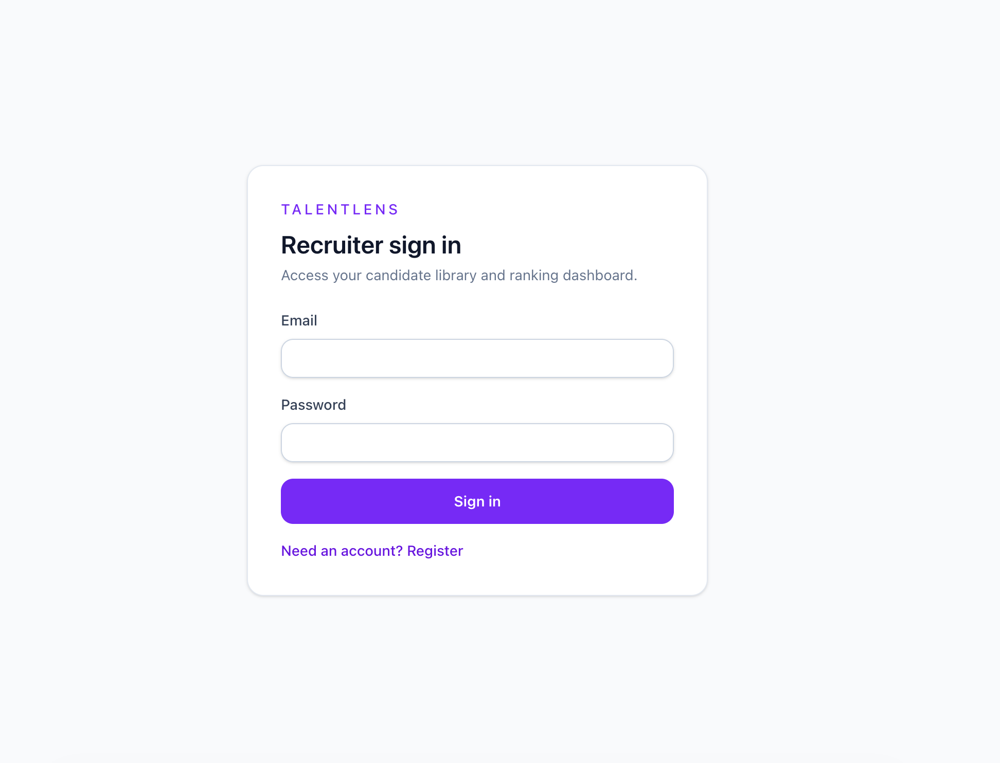
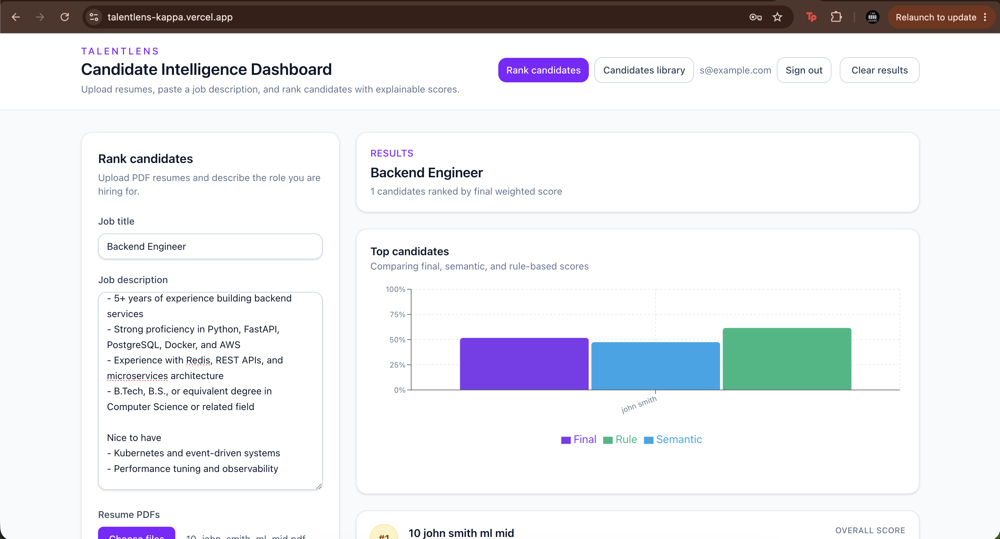
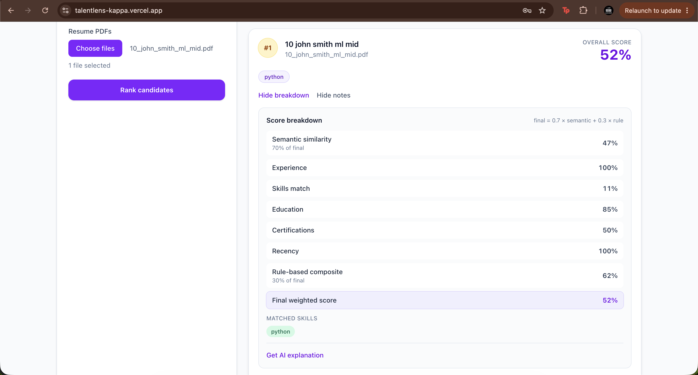
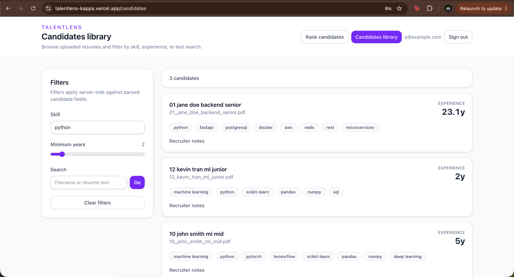

# TalentLens

TalentLens is an AI-powered candidate intelligence and resume ranking platform. Recruiters upload PDF resumes and a job description; the system ranks candidates by combining **semantic similarity** (sentence-transformers embeddings retrieved with FAISS) and **rule-based scoring** (skills, experience, education, certifications, recency). Every ranked result includes a full explainability breakdown so scores are transparent, not a black box.

---

## Architecture

The ranking pipeline is layered and single-responsibility end to end:

```
PDF resume
  → resume_parser (PyMuPDF text extraction)
  → info_extractor (skills, years, education, projects, certifications)
  → embedding_service (MiniLM, loaded once at startup)
  → candidate_embedding_cache (DB-backed vectors + in-memory FAISS index)
  → similarity_service (cosine similarity via IndexFlatIP → float in [0, 1])
  → scoring_service (rule components)
  → hybrid_scoring (final = 0.7 × semantic + 0.3 × rule)
  → ranking API (persist RankingResult, return sorted list)
  → frontend dashboard (upload, rank, cards + charts)
```

### Backend (`backend/app/`)

```
backend/app/
├── main.py                 # FastAPI app, CORS, lifespan (model + FAISS hydrate)
├── api/
│   ├── candidates.py       # POST /upload, GET /
│   ├── job_descriptions.py # POST /, GET /
│   └── ranking.py          # POST /rank
├── core/
│   ├── config.py           # Pydantic Settings
│   ├── database.py         # SQLAlchemy engine / session
│   └── dependencies.py     # DI for embedding service, cache, index
├── models/                 # Candidate, JobDescription, RankingResult
├── schemas/                # Pydantic request/response models
├── services/
│   ├── resume_parser.py
│   ├── info_extractor.py
│   ├── embedding_service.py
│   ├── candidate_embedding_cache.py
│   ├── similarity_service.py
│   ├── scoring_service.py
│   ├── hybrid_scoring.py
│   ├── candidate_service.py
│   ├── job_description_service.py
│   └── ranking_service.py
└── utils/
    ├── embed_text.py       # Structured embed payload (not raw PDF noise)
    ├── skills_keywords.py
    └── text_cleaning.py
```

### Frontend (`frontend/src/`)

```
frontend/src/
├── main.tsx
├── App.tsx                 # React Router → Dashboard
├── pages/
│   └── Dashboard.tsx       # JD input, resume upload, results
├── components/
│   ├── CandidateCard.tsx
│   ├── ScoreBreakdownPanel.tsx
│   └── ScoreChart.tsx      # Recharts bar chart (top candidates)
├── hooks/
│   └── useRanking.ts       # upload → create JD → rank flow
├── services/
│   └── api.ts              # Axios client (VITE_API_BASE_URL)
└── types/
    └── index.ts            # Mirrors backend Pydantic schemas
```

**Scoring formula (tunable constants in `hybrid_scoring.py`):**

```
final_score = 0.7 × semantic_similarity_score + 0.3 × rule_score
```

Rule score sub-weights (`scoring_service.py`): experience 30%, skills 35%, education 15%, certifications 10%, recency 10%.

---

## Tech stack

### Backend (`backend/requirements.txt`)

| Package | Role |
|---------|------|
| FastAPI | HTTP API |
| uvicorn | ASGI server |
| sentence-transformers | Embeddings (`all-MiniLM-L6-v2`) |
| faiss-cpu | Flat IP similarity index |
| SQLAlchemy | ORM (SQLite) |
| Pydantic / pydantic-settings | Schemas & config |
| PyMuPDF | PDF text extraction |
| python-multipart | Multipart uploads |
| pytest / httpx | Tests |
| numpy | Vector math |

### Frontend (`frontend/package.json`)

| Package | Role |
|---------|------|
| React 19 | UI |
| TypeScript | Types |
| Vite 8 | Dev server & build |
| Tailwind CSS 4 | Styling |
| React Router | Routing |
| Axios | API client |
| Recharts | Score charts |
| oxlint | Linting |

---

## Installation

### Prerequisites

- Python 3.11+
- Node.js 20+ (22 recommended for Docker frontend image)
- Docker & Docker Compose (optional)

### Backend

```bash
cd backend
python3 -m venv .venv
source .venv/bin/activate   # Windows: .venv\Scripts\activate
pip install -r requirements.txt
```

### Frontend

```bash
cd frontend
npm install
```

Create `frontend/.env` (or copy from `frontend/.env.example`):

```
VITE_API_BASE_URL=http://127.0.0.1:8002/api/v1
```

### Sample data (optional)

```bash
cd backend
source .venv/bin/activate
python sample_data/generate_samples.py
```

This writes ~20 resume PDFs to `backend/sample_data/resumes/` and 5 job descriptions to `backend/sample_data/job_descriptions/`.

---

## Running locally

### Dev mode (two terminals)

**Backend** (from `backend/`, with venv active):

```bash
uvicorn app.main:app --reload --host 127.0.0.1 --port 8002
```

- API: http://127.0.0.1:8002  
- Swagger: http://127.0.0.1:8002/docs  
- Health: http://127.0.0.1:8002/health  

First startup downloads the MiniLM model from Hugging Face (cached afterward).

**Frontend** (from `frontend/`):

```bash
npm run dev
```

- App: http://127.0.0.1:5173  

### Docker Compose

From the **repo root**:

```bash
docker compose up --build
```

| Service | Host port | Notes |
|---------|-----------|--------|
| `backend` | **8002** → container 8000 | SQLite volume `backend-data`, `sample_data` mounted read-only |
| `frontend` | **5173** | Vite dev server; proxies `/api` to `http://backend:8000` |

Open http://localhost:5173. In Compose, the browser calls same-origin `/api/v1` (`VITE_API_BASE_URL=/api/v1`); Vite forwards to the `backend` service on the shared `talentlens-net` network.

Stop with `Ctrl+C` or `docker compose down`.

---

## API overview

Base path: `/api/v1` (plus `GET /health` at the root).

| Method | Path | Description |
|--------|------|-------------|
| `POST` | `/api/v1/candidates/upload` | Multipart PDF upload (`files`); parse, extract, embed, store |
| `GET` | `/api/v1/candidates` | List candidates |
| `POST` | `/api/v1/job-descriptions` | Create JD (`title`, `text`) |
| `GET` | `/api/v1/job-descriptions` | List job descriptions |
| `POST` | `/api/v1/rank` | Rank candidates for a JD |

Interactive docs: http://127.0.0.1:8002/docs

### Example: `POST /api/v1/rank`

**Request**

```json
{
  "job_description_title": "Backend Engineer",
  "job_description_text": "5+ years of experience. Python, FastAPI, PostgreSQL, Docker, AWS.",
  "candidate_ids": [1, 2, 3],
  "job_description_id": 1
}
```

`job_description_id` is optional; if omitted, a new JD row is created from the title/text. You can also send multipart form data with `resume_files` for a one-shot upload + rank.

**Response** (shape abbreviated)

```json
{
  "job_description_id": 1,
  "job_description_title": "Backend Engineer",
  "ranked_candidates": [
    {
      "candidate_id": 1,
      "filename": "01_jane_doe_backend_senior.pdf",
      "rank": 1,
      "semantic_score": 0.725,
      "rule_score": 0.866,
      "final_score": 0.768,
      "breakdown": {
        "semantic_similarity_score": 0.725,
        "matched_skills": ["python", "fastapi", "postgresql", "docker", "aws"],
        "experience_score": 1.0,
        "education_score": 0.7,
        "certification_score": 0.5,
        "recency_score": 1.0,
        "skills_match_score": 1.0,
        "rule_score": 0.866,
        "final_score": 0.768
      }
    }
  ]
}
```

Candidates are sorted **descending** by `final_score`. Each `breakdown` exposes the explainability fields required for V1.

---

## Testing

From `backend/` with the venv active:

```bash
# Full suite (63 tests), including the real MiniLM embedding check
pytest

# Fast suite — skips the real model download/load
pytest -m "not slow"
```

Current coverage: **63 tests** (unit tests for `info_extractor`, `scoring_service`, `hybrid_scoring`, embedding/similarity helpers; integration test for `POST /api/v1/rank` via FastAPI `TestClient` with a mocked embedding service).

---

## 📸 Screenshots

### Recruiter Login

Secure authentication for recruiters with registration and login.



---

### Candidate Ranking Dashboard

View ranked candidates with overall fit scores, semantic matching, and explainable ranking.



---

### Candidate Insights

Analyze individual candidate profiles, score breakdowns, and evaluation metrics.



---

### Candidate Library

Browse uploaded resumes, search candidates, and manage the talent pool from a centralized library.



---

## Future roadmap

**Not implemented in V1** — planned extensions:

- LLM-powered natural-language explanations of rankings
- Recruiter chat assistant over the candidate pool
- Interview outcome prediction
- Dedicated vector database (e.g. Pinecone / Weaviate / pgvector) replacing local FAISS
- PostgreSQL migration from SQLite
- Redis caching layer
- Authentication & multi-tenant recruiter accounts
- Analytics dashboard (pipeline funnel, time-to-rank, etc.)
- Bias / fairness detection in scoring
- Candidate timeline / interaction history
- Recruiter notes & collaborative review